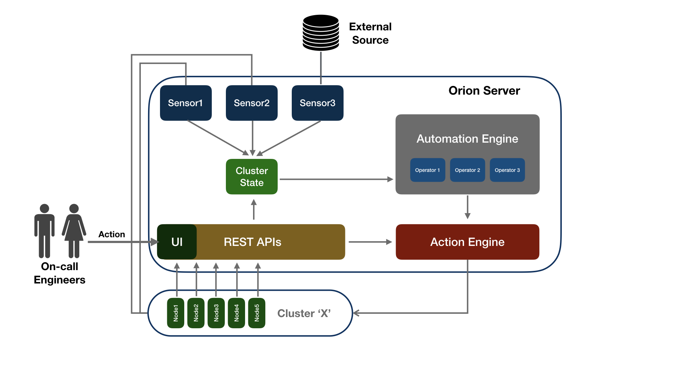

# Orion
Orion is a generalized pluggable management and automation platform for stateful distributed systems. Orion provides a unified interface of one or more clusters to both human and machine operators. Orion is capable of efficiently handling thousands of nodes spread across of 10s of clusters. 

Our intent is to use automation to handle commonly encountered operations issues and build a library of learnings from experiences of various large scale environments like ours.

### Problem
Orion aims to address the following problems:
- **Lack of single console to manage large clusters of Stateful Distributed Systems**: Present open source tooling lacks ability to manage 10s of clusters and 1000s of nodes simultaneously, requiring engineers to switch between multiple consoles and perform manual correlations.


- **Conflicts between human and automation operations**: When automation scripts are implemented they mostly lack the visibility into out of band human operations and vice-a-versa as a single control surface is missing for machine and human operations this has proven to cause catastrophic failures e.g. engineer manually restarts process but automation system thinks that the node is down and replaces it causing stability issues in the cluster.


- **Missing generalized community learnings on operations**: There currently is a lack of a generic unified interface and "store" for sharing community learnings for operations of various systems this leads to various companies having to rewrite remediations of problems. e.g. topic rebalancing in Kafka, auto replacement of slow HDFS nodes, concurrent rolling upgrades etc.


- **Missing ability for sensor fusion for automation**: Lack of ability to fuse information from multiple sensors to find root cause of an issue on cluster to make best decisions for automated remediations. e.g. finding if Kafka replica lag is due to a slow leader or a slow follower or due to increased client load or due to faulty readings for replica lag.

## Key Features

- **Unified Interface**: Orion provides a unified interface to implement human and automation actions along with a barrier to prevent conflicts


- **Library of Remediations**: Orion comes with a pre-defined set of common Sensors, Operators and Actions and interfaces to define new ones to build on-top of learnings


- **Scalable**: Ability to handle thousands of nodes and 10s of clusters efficiently


- **Pluggable**: Orion was developed with the understanding that not all distributed systems behave the same way, pluggability, extensibility and abstraction is at the very core of Orion

## Current State

**Orion is actively under development and the API may change over time.**

Orion currently supports management of the following systems:
- [Kafka](docs/Kafka/README.md)

## Usage
Orion allows implementations of user defined **Action**s which are made available via both UI and as well as automated **Operator**s which allows engineers to program automated remediation of issues based on information from **Sensor**s in a large environment.

Example:
- Safely Replace Nodes in a Cloud Environment
- Concurrent Rolling Restart
- Concurrent Rolling Upgrade
- Execution of custom workflows like Kafka topic rebalancing
- Maintain settings e.g. monitor and fix topic configurations in Kafka

### Temporarily move topics off of particular brokers

In order to temporarily move all topics off of a set of brokers, you can add a `brokersetOverrides.json` in a
cluster's config folder with the `brokerset.json`.
This file should take the form:
```json
{
  "startBrokerIn": 1,
  "endBrokerIn": 3,
  "startBrokerOut": 4,
  "endBrokerOut": 6
}
```
This configuration will make sure that any brokerset that includes the brokers from 1-3 are replaced with the brokers 4-6
This makes it easier to move multiple topics off of particular brokers for maintenance. Once finished, remove the file
to let the original brokers reassert themselves.

## Architecture



## Quick Start

Detailed quick install can be found [here](docs/QuickStart.md)


### Dr.Kafka to Orion Migration
If you were previously using Dr.Kafka you can find instructions on migrating to Orion [here](docs/DrK_Migration.md)

## Maintainers

- Ping-Min Lin
- Ambud Sharma

## Contributors

- Vahid Hashemian
- Jeff Xiang

## License
Orion is distributed under Apache License, Version 2.0.
