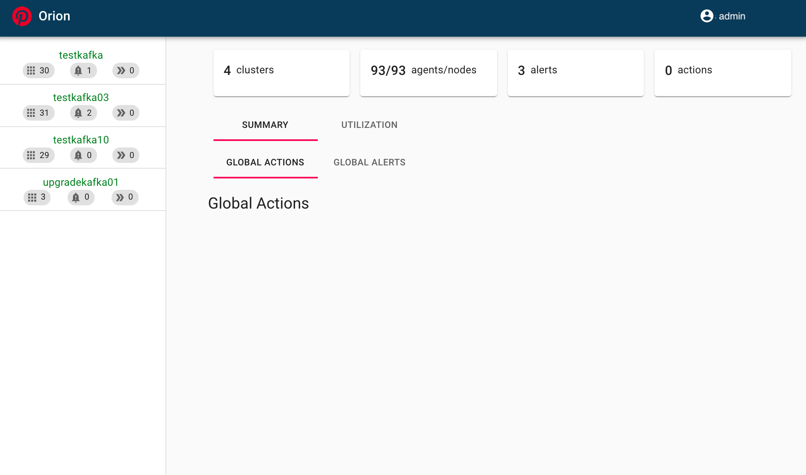
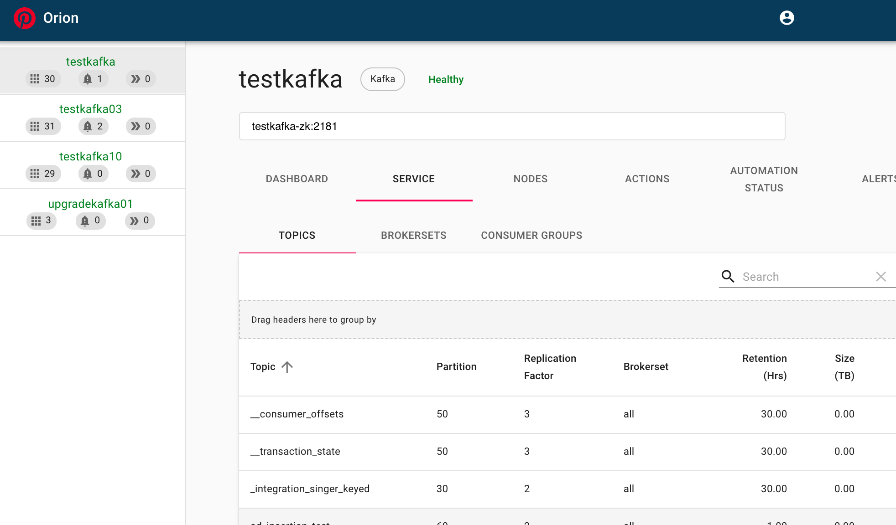

# Quick Start Guide

Here's a quick start guide which will show case how to deploy Orion with example of Kafka service.

### Build

```
git clone https://github.com/pinterest/orion.git
cd orion
bash ./builds/build-deployment.sh
# Agent artifact will be generated in deployments/orion-agent-deployment/target/orion-agent_x.x.x_all.deb
# Server artifact will be generated in deployments/orion-server-deployment/target/orion-server-deployment-x.x.x-bin.tar.gz
# Note: Agent jar is generated as well if you would like to use custom scripts
```

Build scripts for Ubuntu are provided. The build script will attempt to install pre-requisites. If they don't work for your environment the following are needed to build Orion:

- OpenJDK8
- nodejs12/npm
- Maven 3+

### Deploy Server

Here's how to install and run Orion Server:

```
mkdir -p /opt/orion-server/
tar xf orion-server-deployment-x.x.x-bin.tar.gz -C /opt/orion-server
/opt/orion-server/scripts/run_orion.sh
```

### Deploy Agent

Here's how to install and run Orion Agent:

```
sudo dpkg -i orion-agent_x.x.x_all.deb
# edit serverUrl: http://localhost:8444/admin/api and change hostname to the location of the server
# /etc/orion-agent/kafka-agent.yaml
```

### Orion UI

**Overview**




**Cluster Service UI**

